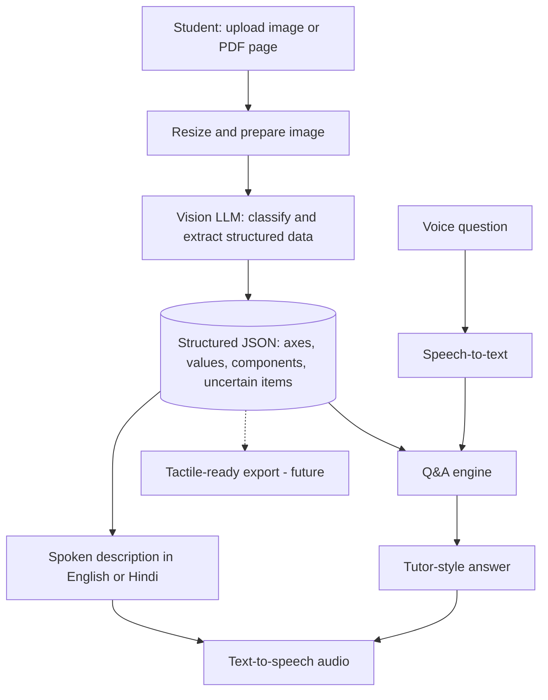

# 🔊 DiagramVoice

**Hear any textbook graph or circuit. Ask doubts by voice, in Hindi or English.**

> Built for HackNova 2026 · Problem Statement: **Inclusive Technology**

🔗 **Live demo:** `https://diagramvoice.streamlit.app/`
🎥 **Demo video:** `PASTE_YOUTUBE_LINK_HERE`


<!-- Add 1-2 screenshots to a /screenshots folder: the description + audio, and voice Q&A -->


## The problem

A visually impaired student can use a screen reader for text, but a **graph, circuit, or figure is just "image" to it**. STEM exams are built on exactly these diagrams, so blind and low-vision students are often locked out of a large part of Physics, Maths, and Science, or depend on a sighted helper for every figure.

Existing options are slow or out of reach: volunteers writing descriptions by hand, tactile-graphics services that take days and need trained transcribers, and general image-description apps that are not built for exam-style diagrams and can invent numbers.

## Our solution

DiagramVoice turns a photo or PDF page of a diagram into a **clear spoken explanation**, and lets the student **ask follow-up doubts by voice**.

1. **Upload** a photo, image, or a PDF page (choose the page that has the diagram).
2. **Listen** to a structured description in **English or Hindi**, always in the same order: type of diagram → overall shape → labelled parts → key values → what it means.
3. **Ask** doubts by voice or text: *"Which grade has the most students?"*, *"bar chart kya hota hai?"*
4. **Trust it:** the app flags what it could not read clearly and says *"I'm not sure"* instead of inventing numbers.

## Key features

| Feature | Status |
|---|---|
| Image upload and PDF page upload | ✅ |
| Graph, bar chart, and circuit understanding | ✅ |
| Structured extraction (JSON) before explaining | ✅ |
| English and Hindi spoken description (audio) | ✅ |
| Voice input and voice answers | ✅ |
| Tutor-style answers to concept doubts | ✅ |
| Uncertainty flagging (no invented numbers) | ✅ |
| Automatic model fallback and retry | ✅ |
| Tactile-ready export (thick-line SVG/PDF) |  ✅ |
| Geometry, biology, physics diagrams | ✅ |
| Quiz generation |  ✅ |
| Braille-ready output | ✅ |
| More Indian languages | ✅ |
| Braille in Indian languages |🔜|
| Testing with blind and low-vision students | 🔜 |

## How it works



**Why two steps?** Asking a model to "describe this image" often gives vague or invented details. DiagramVoice first extracts **structured data** (axes, labels, values, components, and a list of things it is unsure about), then generates the explanation **from that data**. This keeps answers about the diagram grounded.

**Grounding rules in the Q&A:**
- Questions about *this diagram* are answered only from the extracted data. If a value is missing, the app says it is not sure.
- *Concept* questions (for example "what is acceleration?") are answered like a school tutor, in simple words with an everyday example.
- Unrelated questions are politely declined.

**Reliability:** requests go through an ordered list of Gemini models with timeouts. If one is busy, the next is tried automatically, and the last working model is tried first next time.

## Tech stack

- **UI:** Streamlit (web app, works on desktop and phone browsers)
- **Vision, reasoning, and speech-to-text:** Google Gemini API (`google-genai`)
- **Text-to-speech:** gTTS (English and Hindi)
- **PDF to image:** PyMuPDF
- **Image handling:** Pillow
- **Language:** Python 3.10+

## Accuracy test

We tested the extraction on a set of textbook-style diagrams and checked each result by hand against the original image.

| Image | Type correct | Axes / labels correct | Values correct | No invented numbers |
|---|---|---|---|---|
| Bar chart (student grades) | ✅ | ✅ | ✅ | ✅ |
| Parabola / displacement-time graph |  ✅ |  ✅ |  ✅ |  ✅ |
| Velocity-time graph |  ✅ |  ✅ |  ✅ |  ✅ |
| Uniform acceleration graph |  ✅ |  ✅ |  ✅ |  ✅ |
| Simple circuit |  ✅ |  ✅ |  ✅ |  ✅ |

**Result:** `X of N` diagrams fully correct. <!-- Fill in your real numbers. Do not guess. -->

Raw model outputs are in the [`results/`](results/) folder.

## Limitations (honest notes)

- Built on a general AI model, so it can misread blurry or crowded diagrams. Uncertain readings are flagged, but not every error will be caught.
- Concept explanations come from the AI's general knowledge. **Please verify with a teacher.**
- Pages with a lot of text plus a diagram may be described as a whole. Choose a page where the diagram is the main content, or crop first.
- Each question is answered independently (no conversation memory yet).
- Not yet tested with blind or low-vision users. This is our first next step.
- Tactile drawings only exist for graphs and bar charts.
- Braille is English Grade 1 only and hasn't been checked by a certified transcriber.

## Related tools and how we differ

*(Based on our understanding at the time of writing. Features change.)*

| Tool | Focus | Where DiagramVoice differs |
|---|---|---|
| Be My Eyes / Be My AI | General photo description | Built for exam-style graphs and circuits, structured output, Hindi tutor, uncertainty flagging |
| Seeing AI, Lookout, Envision | Text and everyday-object reading | Focus on STEM diagrams |
| Chatbots (ChatGPT, Gemini) | Free-form description | Grounded extract-then-explain pipeline, voice-first, student workflow |
| Desmos audio trace, SAS Graphics Accelerator | Accessible graphs from software data | Works on photos and scanned textbook pages |
| Tactile graphics services, embossers | Physical tactile output | Instant and free; tactile-ready export is planned |

## Run it locally

```bash
git clone https://github.com/YOUR_USERNAME/diagramvoice.git
cd diagramvoice

python -m venv venv
venv\Scripts\activate          # Windows
# source venv/bin/activate     # Mac/Linux

python -m pip install -r requirements.txt
```

Create a `.env` file (see `.env.example`):

```
GEMINI_API_KEY=your_key_here
```

Get a key from [Google AI Studio](https://aistudio.google.com/). Then run:

```bash
python -m streamlit run app.py
```

Open `http://localhost:8501`. Allow microphone access for voice questions.

**Note:** model names change often. If you see a "model not found" error, run `list_models.py` and update the `MODELS` list in `app.py`.

## Project structure

```
diagramvoice/
├── app.py              # Streamlit app (UI + pipeline)
├── test.py             # Single-image extraction test
├── batch_test.py       # Runs extraction on all images in test_images/
├── list_models.py      # Lists models available to your API key
├── test_images/        # Sample diagrams used for testing
├── results/            # Saved JSON outputs from batch tests
├── requirements.txt
├── .env.example
└── README.md
```

## Future scope

- Crop tool and multi-diagram pages
- offline mode
- Testing and co-design with blind and low-vision students and teachers

## Author

Solo project by **SHREYA CHAUHAN** 

## Credits

- Sample diagrams are used for testing only; credit belongs to their original sources (for example Vedantu and other educational sites). Replace them with your own drawings before wider distribution.
- Built with Streamlit, Google Gemini, gTTS, PyMuPDF, and Pillow.
