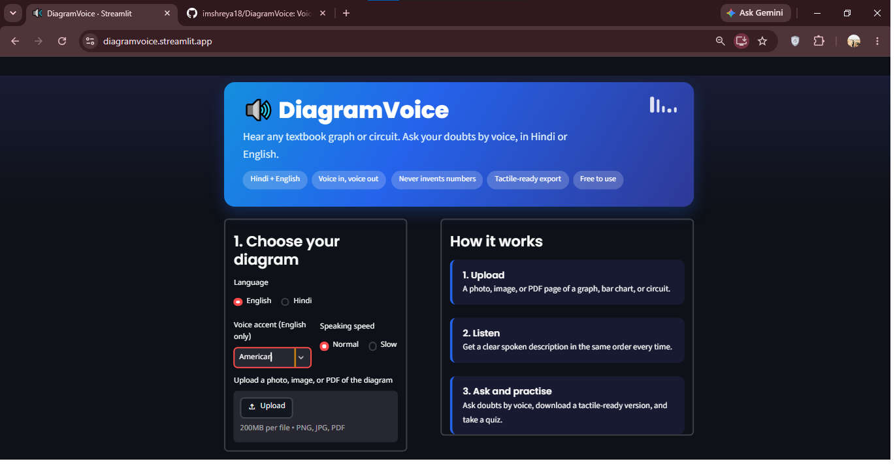
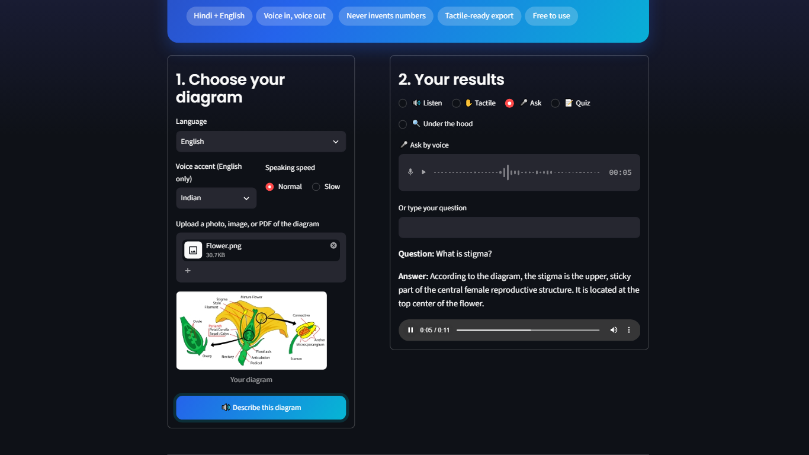
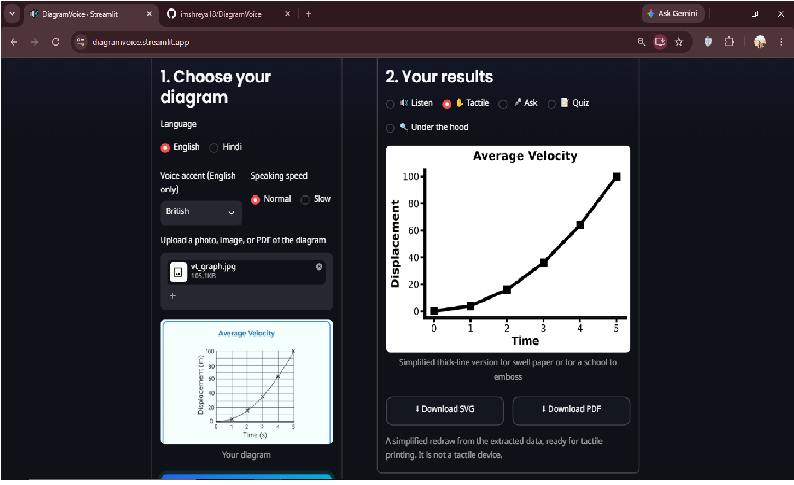
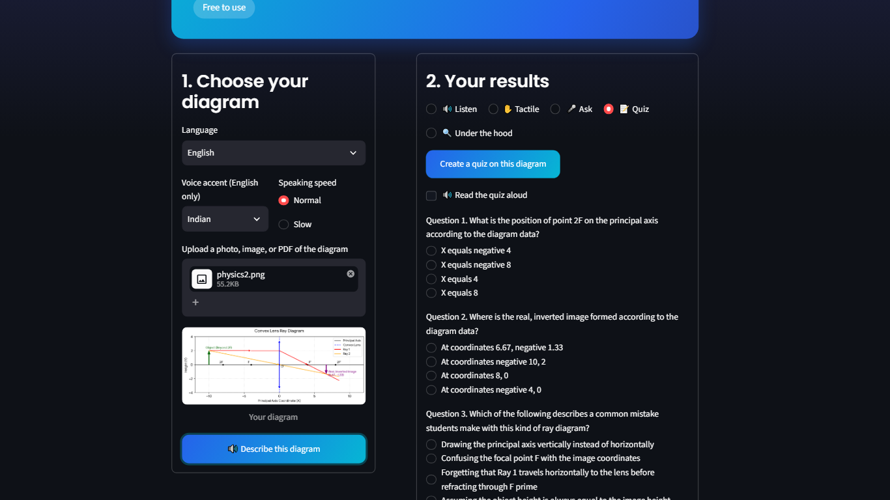
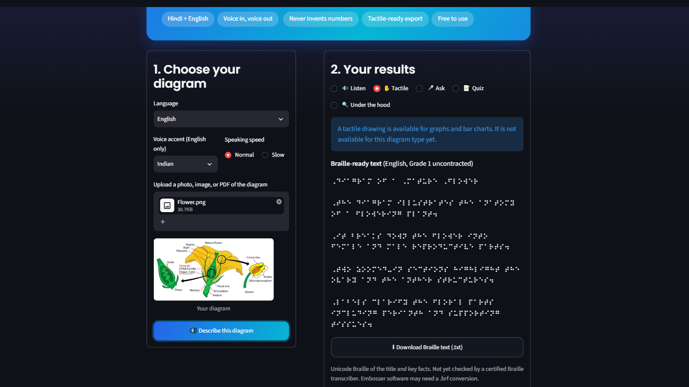
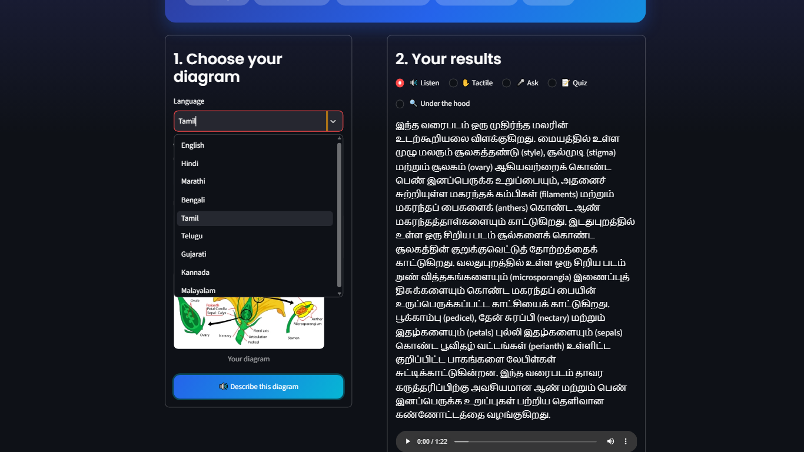
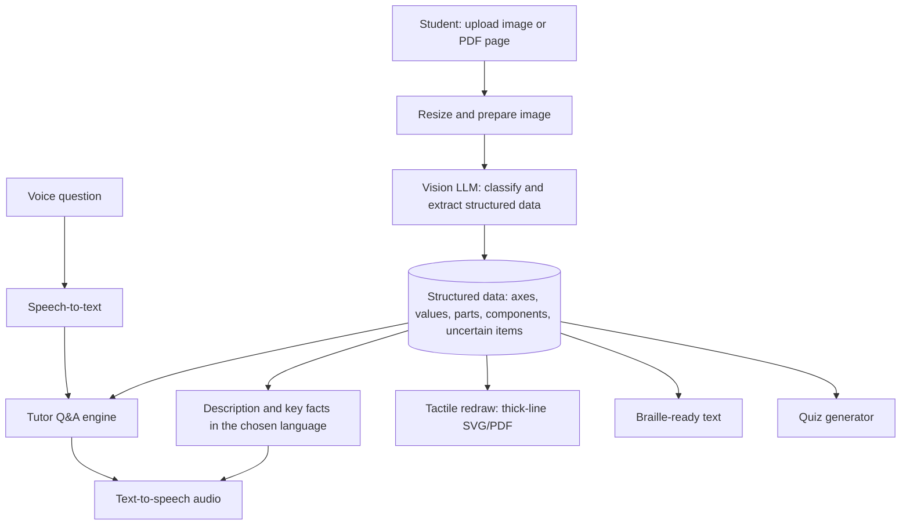

# 🔊 DiagramVoice

**Hear any textbook graph, circuit, or science diagram. Ask doubts by voice, in English, Hindi, and 7 other Indian languages.**

> Built solo for HackNova 2026 · Problem Statement: **Inclusive Technology**

🔗 **Live demo:** https://diagramvoice.streamlit.app/
🎥 **Demo video:** `PASTE_YOUTUBE_LINK_HERE`




| Tactile export | Practice quiz |
|---|---|
|  |  |

| Braille-ready text | Indian languages |
|---|---|
|  |  |

---

## The problem

A visually impaired student can use a screen reader for text, but a **graph, circuit, or figure is just "image" to it**. STEM exams are built on exactly these diagrams, so blind and low-vision students are often locked out of a large part of Physics, Maths, and Science, or depend on a sighted helper for every figure.

Existing options are slow or out of reach: volunteers writing descriptions by hand, tactile-graphics services that take days and need trained transcribers, and general image-description apps that are not built for exam-style diagrams and can invent numbers.

## Our solution

DiagramVoice turns a photo or PDF page of a diagram into a **clear spoken explanation**, and lets the student **ask follow-up doubts by voice**.

1. **Upload** a photo, image, or a PDF page (choose the page that has the diagram).
2. **Listen** to a structured description, always in the same order: type of diagram → overall shape or layout → labelled parts → key values → what it means. Pick English, Hindi, or another Indian language, and switch at any time without re-uploading.
3. **Ask** doubts by voice or text: *"Which grade has the most students?"*, *"bar chart kya hota hai?"*
4. **Download** a tactile-ready thick-line version (graphs and bar charts) and a Braille-ready text summary, and **practise** with a quiz.
5. **Trust it:** the app flags what it could not read clearly and says *"I'm not sure"* instead of inventing numbers.

## Key features

| Feature | Status |
|---|---|
| Image upload and PDF page upload | ✅ |
| Graphs, bar charts, circuits | ✅ |
| Geometry, biology, and physics diagrams | ✅ |
| Structured extraction (JSON) before explaining | ✅ |
| Spoken description in English, Hindi, Marathi, Bengali, Tamil, Telugu, Gujarati, Kannada, Malayalam (switch without re-describing) | ✅ |
| Voice questions and spoken answers | ✅ |
| Tutor-style answers to concept doubts | ✅ |
| Practice quiz in the chosen language (new questions each time) | ✅ |
| Tactile-ready export (thick-line SVG/PDF) for graphs and bar charts | ✅ |
| Braille-ready text (English, Grade 1) | ✅ |
| Uncertainty flagging (no invented numbers) | ✅ |
| Voice accent and speed options | ✅ |
| Automatic model fallback and retry | ✅ |
| Tactile drawings for circuits, biology, and geometry | 🔜 |
| Braille in Indian languages | 🔜 |
| Testing with blind and low-vision students | 🔜 |

## How it works



**Why two steps?** Asking a model to "describe this image" often gives vague or invented details. DiagramVoice first extracts **structured data** (axes, labels, values, parts, and a list of things it is unsure about), then generates every explanation, answer, quiz, and tactile drawing **from that data**. This keeps answers about the diagram grounded.

**Grounding rules in the Q&A:**
- Questions about *this diagram* are answered only from the extracted data. If a value is missing, the app says it is not sure.
- *Concept* questions (for example "what is acceleration?") are answered like a school tutor, in simple words with an everyday example.
- Unrelated questions are politely declined.

**Reliability:** requests go through an ordered list of Gemini models with timeouts. If one is busy, the next is tried automatically, and the last working model is tried first next time.

## Tech stack

- **UI:** Streamlit (web app, works on desktop and phone browsers)
- **Vision, reasoning, translation, and speech-to-text:** Google Gemini API (`google-genai`)
- **Text-to-speech:** gTTS (English, Hindi, and 7 other Indian languages)
- **Tactile drawing:** Matplotlib (SVG and PDF)
- **PDF to image:** PyMuPDF
- **Image handling:** Pillow
- **Language:** Python 3.10+

## Accuracy test

Each test diagram was uploaded to the live app and the result was checked by hand against the original image. Full notes are in [`results/accuracy.md`](results/accuracy.md).

| Image | Type correct | Labels / parts correct | Values correct | No invented numbers |
|---|---|---|---|---|
| Bar chart (student grades) | ✅ | ✅ | ✅ | ✅ |
| Parabola / displacement-time graph | ✅ | ✅ | ✅ | ✅ |
| Velocity-time graph | ✅ | ✅ | ✅ | ✅ |
| Uniform acceleration graph | ✅ | ✅ | ✅ | ✅ |
| Simple circuit | ✅ | ✅ | ✅ | ✅ |
| Flower (biology) | ✅ | 	⚠️ first run left out Petal (Corolla) and Sepal (Calyx) under Perianth | ✅ | ✅ |
| convex lens (physics) | ✅ | ⚠️ first run left out the legend (Principal Axis, Convex Lens, Ray 1, Ray 2) | ✅ | ✅ |
| Geometry figure | ✅ | ✅ | ✅ | ✅ |

**Result:** `6 of 8` diagrams fully correct.

**What we fixed** : the extraction prompt now asks for every printed label, including sub-labels, and for the legend, and the spoken description has more room to name them.


## Limitations (honest notes)

- Built on a general AI model, so it can misread blurry or crowded diagrams. Uncertain readings are flagged, but not every error will be caught.
- Concept explanations come from the AI's general knowledge. **Please verify with a teacher.**
- Pages with a lot of text plus a diagram may be described as a whole. Choose a page where the diagram is the main content, or crop first.
- Each question is answered independently (no conversation memory yet).
- Translations into Indian languages come from an AI model and have not been reviewed by native speakers for every language.
- Tactile drawings exist only for graphs and bar charts.
- Braille is English Grade 1 only and has not been checked by a certified transcriber.
- Not yet tested with blind or low-vision users. This is the first next step.

## Related tools and how we differ

*(Based on our understanding at the time of writing. Features change.)*

| Tool | Focus | Where DiagramVoice differs |
|---|---|---|
| Be My Eyes / Be My AI | General photo description | Built for exam-style diagrams, structured output, Indian-language tutor, uncertainty flagging |
| Seeing AI, Lookout, Envision | Text and everyday-object reading | Focus on STEM diagrams |
| Chatbots (ChatGPT, Gemini) | Free-form description | Grounded extract-then-explain pipeline, voice-first, student workflow, tactile and Braille outputs |
| Desmos audio trace, SAS Graphics Accelerator | Accessible graphs from software data | Works on photos and scanned textbook pages |
| Tactile graphics services, embossers | Physical tactile output | Instant and free; produces a print-ready file but not the physical output |

## Run it locally

```bash
git clone https://github.com/imshreya18/DiagramVoice.git
cd DiagramVoice

python -m venv venv
venv\Scripts\activate          # Windows
# source venv/bin/activate     # Mac/Linux

python -m pip install -r requirements.txt
```

Create a `.env` file (see `.env.example`):

```
GEMINI_API_KEY=your_key_here
```

Get a key from [Google AI Studio](https://aistudio.google.com/). Then run:

```bash
python -m streamlit run app.py
```

Open `http://localhost:8501`. Allow microphone access for voice questions.

**Note:** model names change often. If you see a "model not found" error, run `list_models.py` and update the `MODELS` list in `app.py`.

## Project structure

```
DiagramVoice/
├── app.py              # Streamlit app (UI + pipeline)
├── test.py             # Single-image extraction test
├── batch_test.py       # Early batch extraction test
├── list_models.py      # Lists models available to your API key
├── test_images/        # Sample diagrams used for testing
├── results/            # Accuracy notes and early raw outputs
├── screenshots/        # Images used in this README
├── .streamlit/         # Streamlit configuration
├── requirements.txt
├── .env.example
└── README.md
```

## Future scope

- Tactile drawings for circuits, biology, and geometry
- Braille in Indian languages and contracted Braille
- Crop tool and multi-diagram pages
- Conversation memory in Q&A
- Offline mode
- Testing and co-design with blind and low-vision students and teachers

## Author

Solo project by **Shreya Chauhan**

## Credits

- Sample diagrams are used for testing only; credit belongs to their original sources (for example Vedantu and other educational sites).
- Built with Streamlit, Google Gemini, gTTS, PyMuPDF, Matplotlib, and Pillow.
